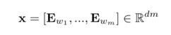
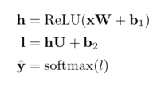
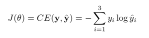

# Neural-Transition-Based-Dependency-Parser

In this project, we implement a neural-network based dependency parser, with the goal of maximizing performance on the UAS (Unlabeled Attachemnt Score) metric. There are two parts to this implementation
- **Transition based parser**: This incrementally builds up a dependency parse one step at a time. At every step it maintains a partial parse, which is represented as follows:
	- A `stack` of words that are currently being processed. 
	- A `buffer` of words yet to be processed.
	- A list of `dependencies` predicted by the parser.
Initially, the stack only contains ROOT, the dependencies list is empty, and the buffer contains all words of the sentence in order. At each step, the parser applies a transition to the partial parse until its buffer is empty and the stack size is 1. The following transitions can be applied:
	- SHIFT: removes the first word from the buffer and pushes it onto the stack.
	- LEFT-ARC: marks the second (second most recently added) item on the stack as a dependent of the first item and removes the second item from the stack.
	- RIGHT-ARC: marks the first (most recently added) item on the stack as a dependent of the second item and removes the first item from the stack.

- **Neural Network Classifier**: This NN predicts which of the 3 transitions (SHIFT, LEFT-ARC or RIGHT-ARC) the parser needs to apply in its next step, given the state of the stack, buffer and the dependencies. 
	- First, the model extracts a feature vector representing the current state. We will be using the feature set presented in the original neural dependency parsing paper: [A Fast and Accurate Dependency Parser using Neural Networks](https://nlp.stanford.edu/pubs/emnlp2014-depparser.pdf). This feature vector consists of a list of tokens (e.g., the last word in the stack, first word in the buffer, dependent of the second-to-last word in the stack if there is one, etc.). The input to the NN is a concatenated vector of the embedding for each of these tokens:
	
	
	- We use one hidden layer with 200 nodes and ReLU activation function
	- The final output layer has 3 nodes (SHIFT, LEFT-ARC and RIGHT-ARC)

The predictions are computed as 

where **h** is the hidden layer, **l** are the logits of the output layer and $\hat{y}$ are the probabilities. The model minimizes the cross-entropy loss


To train the neural network model and compute the predictions on the test data from Penn Treebank (annotated with Universal Dependencies)
```
python run.py
```
